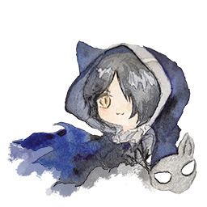

<!--suppress ALL -->

# Arkwaifu (arkwaifu)

Arkwaifu is a website which, arranges and provides almost all artworks extracted from Arknights (the game). Arkwaifu
also enlarges (4x) the artworks with super-resolution neural networks - Real-ESRGAN.

🎉 Arkwaifu v1 has released! Check it at [arkwaifu.cc](https://arkwaifu.cc/)!

🇨🇳 The China mirror has been suspended due to the v0 → v1 upgrade. We will make our best efforts to get it back soon.

For more information of the frontend of Arkwaifu, please refer to
the [frontend repo](https://github.com/FlandiaYingman/arkwaifu-frontend).

## Features

- The arts are automatically updated as soon as the game updates.
- Assets are enlarged with super-resolution neural networks (Real-ESRGAN).

## Available Arts

Now, only arts that appear in the "in-game stories", are available, including **images**, **backgrounds** and *
*characters**.

### Images

Images are the exquisite artworks that appear when some special events in the stories happen.

### Backgrounds

Backgrounds are the artworks that always appear during dialogue between characters.

### Characters

Characters are the artworks that represents characters that appear during dialogue.

## V1 Roadmap

- [x] Switchable language.
- [ ] Support searching.

## Acknowledgements

Thanks to my friend [Galvin Gao](https://github.com/GalvinGao)!
He helped me a lot in the front-end development and choosing frameworks. I really appreciate the "getting hands dirty"
methodology very much.

Thanks to my friend [Martin Wang](https://github.com/martinwang2002)!
He helped me in extracting the gamedata assets, and also in some details of automatically updating the assets from the
game.

Thanks to my friend Lily! She drew the fascinating [Phantom logo](assets/arkwaifu_phantom.png) of this project.

Thanks to [Penguin Statistics](https://penguin-stats.io/)!
The prototype of this project referenced and is inspired by Penguin
Statistics' [backend v3](https://github.com/penguin-statistics/backend-next).

Thanks to [xinntao](https://github.com/xinntao), [nihui](https://github.com/nihui), and the other contributors
of [Real-ESRGAN](https://github.com/xinntao/Real-ESRGAN)
and [Real-CUGAN](https://github.com/bilibili/ailab/tree/main/Real-CUGAN)! They created the neural networks this project
utilizes for enlarging assets.

## License

The source code of this project is licensed under the [MIT License](LICENSE).

The assets of this project are licensed under
[Attribution-NonCommercial 4.0 International (CC BY-NC 4.0)](https://creativecommons.org/licenses/by-nc/4.0/).

This project utilizes resources and other works from the game Arknights. The copyright of such works belongs to the
provider of the game, 上海鹰角网络科技有限公司 (Shanghai Hypergryph Network Technology Co., Ltd).

This project utilizes [Real-ESRGAN](https://github.com/xinntao/Real-ESRGAN)
and [Real-ESRGAN-ncnn-vulkan](https://github.com/xinntao/Real-ESRGAN-ncnn-vulkan), which are respectively licensed under
the BSD-3-Clause license and the MIT License.

This project utilizes [Real-CUGAN](https://github.com/bilibili/ailab/tree/main/Real-CUGAN)
and [Real-CUGAN-ncnn-vulkan](https://github.com/nihui/realcugan-ncnn-vulkan), which are both licensed under the MIT
License.

Some initial template source code of this project is inspired by and copied from
the [backend v3](https://github.com/penguin-statistics/backend-next) of [Penguin Statistics](https://penguin-stats.io/),
which is licensed under the [MIT License](https://github.com/penguin-statistics/backend-next/blob/dev/LICENSE).
